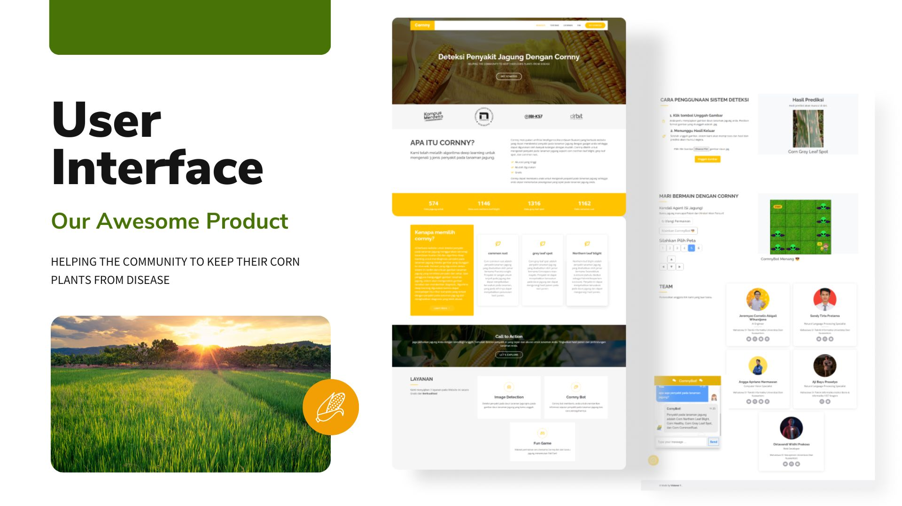

## Corn Disease Detection
Projek Akhir di Orbit Future Academy

## Goals
* Untuk membantu petani dalam mengidentifikasi dan mencegah kerusakan tanaman jagung akibat serangan penyakit dengan cara yang lebih cepat, akurat, dan efektif.
* Mendeteksi kondisi dari tanaman jagung

## Features
### Computer Vision
Deteksi penyakit pada daun tanaman jagung melalui gambar daun tanaman jagung yang diunggah oleh pengguna

### Natural Language Processing
Chatbot untuk memberikan informasi seputar penyakit tanaman jagung dan juga cara pencegahannya.

### Reinforcement Learning
Permainan 2D sederhana dimana pemain membantu si jagung untuk bertemu dengan petani dan menghindari alien pencuri. Pemain juga dapat memerintahkan CornnyBot untuk menyelesaikan permainan.

### GUIDE

`pip install gym==0.17.3`  
`flask run`

## Team Visioner 1
* Jeremyas Cornelis Abigail Wihardjono
* Angga Apriano Hermawan
* Oktavandi Widhi Prakoso
* Aji Bayu Prasetyo
* Sandy Tirta Pratama

## Tech Stack
* Frontend
    * HTML
    * CSS
    * Javascript
    * AJAX
    * Bootstrap
    * Jquery
* Backend
    * Python
    * Flask
* Modelling
    * Keras
    * Tensorflow
    * nltk
    * numpy
    * pandas
    * opengym
* Deployment
    * Ngrok

# Preview Cornny Website

